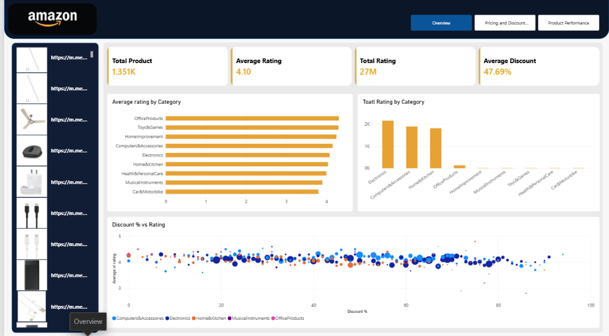
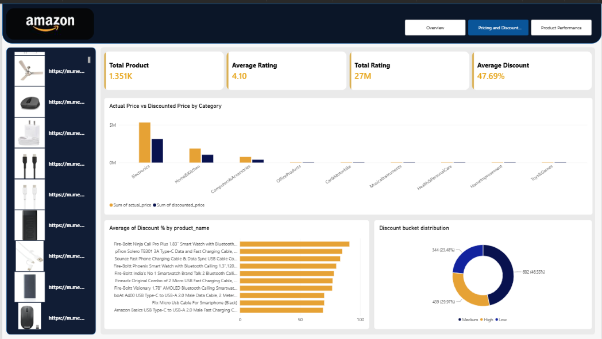
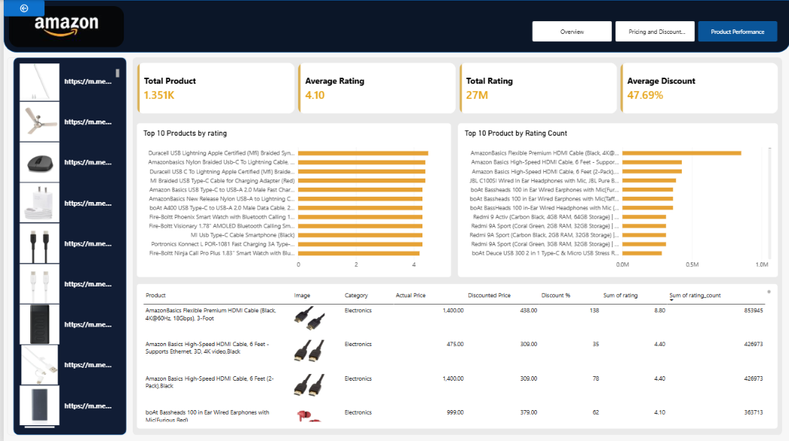

# Amazon Product Analytics Dashboard

## Project Overview

This project presents an interactive Amazon Product Analytics dashboard developed using Microsoft Power BI to analyze product pricing, discounts, ratings, customer engagement, and product performance.

The dashboard provides insights into product ratings, rating counts, pricing differences, discount patterns, category-level performance, and top-performing products.

## Business Objective

Amazon product data contains information about product prices, discounts, ratings, reviews, and customer engagement.

The objective of this project is to analyze product-level data, identify pricing and discount patterns, understand product performance, and provide meaningful insights through an interactive Power BI dashboard.

## Tools and Technologies

- Microsoft Power BI
- DAX
- Power Query
- Data Cleaning and Transformation
- Data Modeling
- Data Visualization
- Product Analytics

## Dashboard Overview

The dashboard consists of three analytical pages:

### 1. Product Overview

Provides a high-level overview of the Amazon product dataset, including:

- Total Products
- Average Rating
- Total Ratings
- Average Discount
- Average Rating by Category
- Total Ratings by Category
- Discount Percentage vs Rating
- Category-level product analysis

### 2. Pricing and Discounts

Focuses on product pricing and discount analysis, including:

- Actual Price vs Discounted Price
- Category-wise Price Comparison
- Average Discount Percentage
- Discount Distribution
- Product-level Discount Analysis

### 3. Product Performance

Focuses on identifying products with higher ratings and customer engagement, including:

- Top 10 Products by Rating
- Top 10 Products by Rating Count
- Product Category
- Actual Price
- Discounted Price
- Discount Percentage
- Rating
- Rating Count
- Product-level performance analysis

## Key Performance Indicators

| KPI | Value |
|---|---:|
| Total Products | 1,351 |
| Average Rating | 4.10 |
| Total Ratings | 27M |
| Average Discount | 47.69% |

## Key Insights

The analysis highlights several patterns in Amazon product data:

- Product ratings vary across different product categories.
- Some product categories receive higher customer engagement based on rating counts.
- Products show differences between actual prices and discounted prices.
- Discount percentages vary across products and categories.
- Highly rated products can be identified using product-level rating analysis.
- Products with a higher number of ratings indicate comparatively higher customer engagement.
- The relationship between discount percentage and product ratings can be explored through interactive visualizations.

## Business Recommendations

Based on the analysis, businesses can consider:

1. Monitoring product categories with higher customer engagement.
2. Evaluating pricing and discount strategies across different product categories.
3. Identifying highly rated products to understand factors associated with better customer response.
4. Monitoring products with low ratings and customer engagement.
5. Using product-level analytics to support pricing and promotional decisions.
6. Regularly analyzing product performance to identify changing customer preferences.

## Dashboard Preview

### Product Overview



### Pricing and Discounts



### Product Performance



## Project Structure

```text
Amazon_Product_Analytics_Dashboard/
│
├── Dashboard/
│   └── Amazon_Product_Analytics_Dashboard.pbix
│
├── Dataset/
│   └── amazon.csv
│
├── Screenshots/
│   ├── Overview.png
│   ├── Pricing_Discount.png
│   └── Product_Performance.png
│
├── Documentation/
│   ├── Business_Problem.md
│   ├── Data_Cleaning.md
│   ├── Data_Dictionary.md
│   ├── Key_Insights.md
│   └── Recommendations.md
│
├── DAX/
│   └── Measures.md
│
└── README.md
